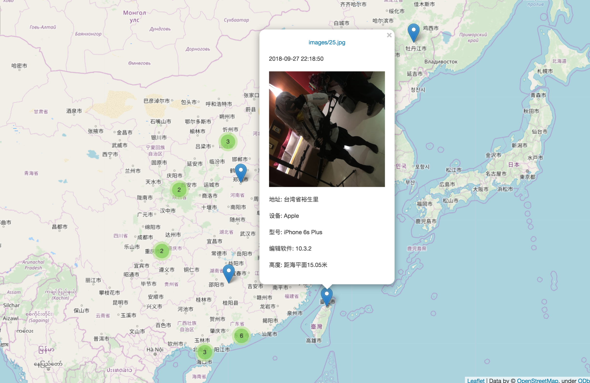

<p align="center">
    
    <h1 align="center" >EXIF-Finder</h1>
    <p align="center">Find out gps data by exif information accross the unprocessed photos</p>
    <p align="center"> <a target="_blank" href="https://www.python.org/downloads/" title="Python version"></a>
    <a target="_blank" href="LICENSE" title="License: MIT"></a></p>
</p>

这是一个用于检索出相册中留存有GPS定位信息图像的工具，且用法很简单。只需要输入如下命令即可

```bash
python3 run.py -t [path]
```

如果您需要(-l 参数)或许定位地区的中文名称，您就需要提前到`restapi.amap.com`站点申请一个自己的`key`并填入`conf.py`中。


### 参数说明:

- `-t`: 指定相册地址【必要参数】
- `-s`: 指定图片存储文件夹名
- `-l`: 开启地理定位附近位置查询功能
- `-a`: 开启地图投影功能，默认添加图片存储地址为`image`
- `--dark`: 开启暗黑地图模式
- `--locus`: 开启标点轨迹【依据时间排布】


### 安装:

```
pip install -r requirements.txt
```

### 结果案例:

```json
[

    {
        "path": "images/34.jpg",
        "date": "2016-06-21 23:10:27",
        "gps": [
            34.78708,
            113.63151497222222
        ],
        "alt": [
            0,
            "海平面"
        ],
        "soft": "gemini-user 6.0 MRA58K V7.3.10.0.MAACNDD release-keys",
        "model": "MI 5",
        "make": "Xiaomi",
        "address": "河南省郑州市金水区南阳新村街道第九人民医院家属院"
    },
    {
        "path": "images/0.jpg",
        "date": "2016-07-20 12:21:15",
        "gps": [
            47.362586972222225,
            123.91117858333334
        ],
        "alt": [
            0,
            "海平面"
        ],
        "soft": "Adobe Photoshop CC 2018 (Windows)",
        "model": "m2 note",
        "make": "Meizu",
        "address": "黑龙江省齐齐哈尔市梅里斯达斡尔族区梅里斯乡浏园"
    }
 
]

```

### 👯一次女装图集的分析结果

图集项目地址: [https://github.com/komeiji-satori/Dress](https://github.com/komeiji-satori/Dress)




